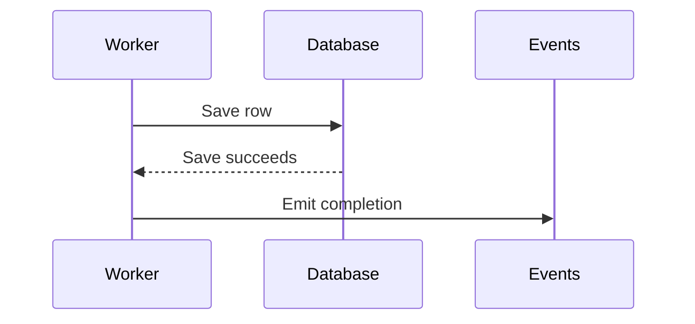

# Writing Pull Requests

Help reviewers understand the problem, the resulting behavior, and the evidence supporting the change. Describe the final patch for someone who has not seen the authoring conversation.

Before drafting, inspect the current diff against the intended base, the repository's PR template, and available test results. Use supplied artifacts when repository access is unavailable, and state material evidence gaps. Reconcile the title and body with the final scope after revisions.

## PR Title

Use Conventional Commits format:

```
<type>(<scope>): <description>
```

### Types

| Type       | Use for                                    |
|------------|--------------------------------------------|
| `feat`     | New feature                                |
| `fix`      | Bug fix                                    |
| `docs`     | Documentation only                         |
| `refactor` | Code restructure (no behavior change)      |
| `perf`     | Performance improvement                    |
| `test`     | Adding or fixing tests                     |
| `chore`    | Maintenance, dependencies, configs         |
| `build`    | Build system changes                       |
| `ci`       | CI/CD configuration                        |

### Scope

Optional noun in parentheses describing the affected area: `fix(auth):`, `feat(api):`, `docs(readme):`

### Description Rules

- Use imperative mood: "Add" not "Added" or "Adds"
- Start with capital letter
- No period at end
- Keep under 50 characters when possible

### Examples

```
feat(auth): Add OAuth2 login support
fix(api): Handle null response in user endpoint
docs: Update installation instructions
refactor(db): Simplify query builder logic
feat!: Remove deprecated v1 API endpoints
```

Use `!` before `:` to indicate breaking changes.

## PR Body Template

Follow the repository's template when present. Otherwise, adapt this template to the change. A small fix may need only a summary and validation. Add review aids within Changes when they clarify behavior or help reviewers navigate the diff; omit unused sections and checklists.

```markdown
## Summary

<What this PR does and why. Link related issues.>

Fixes #123

## Changes

- <Specific change 1>
- <Specific change 2>

## Testing

<Commands actually run, observed results, and relevant limits>

<Separate any suggested manual verification from completed checks>

## Checklist

- [ ] Tests added/updated
- [ ] Documentation updated (if needed)
- [ ] Breaking changes noted (if any)
```

## Writing Guidelines

### Summary Section

Lead with the concrete problem and resulting behavior. Include a trigger and before/after example when that makes the change easier to assess.

- Be specific—avoid vague phrases like "improve performance" or "enhance UX"
- Link related issues using keywords: `Fixes #123`, `Closes #456`, `Related to #789`
- Don't assume readers will read linked issues—include essential context

### Changes Section

Describe concrete behavior and design choices that help reviewers assess the patch. For a change spanning several files, name the entry point and key files or symbols in a useful reading order. Include technical details when they explain a tradeoff, dependency, or risk.

**Good:**
- Add rate limiting to API endpoints
- Update error messages to include request ID

**Avoid:**
- Changed line 42 in auth.js
- Refactored some code

### Review aids

For AI-authored PRs, give reviewers a compact explanation they can check against the code. Choose the smallest useful view. A straightforward patch may need none; a complex patch may benefit from more than one when each answers a different question.

Use `$show-me` when available to build a focused visual explanation. Read its guidance when choosing a view. If it is unavailable, use the inline forms below. Keep PR content readable on its own with fenced `diff`, `text`, or `mermaid` blocks. Link supplemental artifacts only when reviewers can access them; local file paths are not usable PR attachments.

| Reviewer question | Useful view |
|-------------------|-------------|
| What changed in an existing flow or structure? | A small before/after `diff` sketch |
| What decisions does the new logic make? | Pseudocode with inputs, branches, side effects, and outcomes |
| How do components, data, or states interact? | A Mermaid sequence, flow, or state diagram |
| Where should I start in a broad refactor? | A shallow file, component, or call tree with responsibilities |

Place each view beside the explanation it supports. Use names from the patch and retain ordering, ownership, and error paths that matter to the change. Label simplified sketches as conceptual so reviewers do not mistake them for literal source diffs. Check every view against the final patch, and point to the relevant files or symbols for verification.

For example, a conceptual pseudocode diff can explain a save-path change:

```diff
 on save(content)
+  if content equals stored content
+    return existing result
   persist content
   return saved result
```

Use standalone pseudocode when most of the logic is new. Keep it at the decision level so it explains the behavior without duplicating the implementation.

Use Mermaid when interactions or timing are the review question. For example, a completion event that must follow a successful save:



Label this as the success path if failures also matter, and describe or diagram the relevant failure behavior. Avoid a diagram that merely repeats an adjacent sketch or a short sentence.

### Testing Section

Report validation that actually happened. Name the command, tested behavior, and observed result; include the revision or environment when it affects reproducibility. Link relevant test cases, CI runs, or captured output when available. Keep excerpts short and preserve the assertion or failure reason that matters.

Separate completed checks from suggested verification. State relevant checks not run and material limits, such as mocked dependencies or untested concurrency. If no results are available, say so instead of turning proposed commands into passing evidence.

#### TDD evidence

When test-driven development was used and its sequence is supported by execution records, include a compact account in Testing:

| Stage | Evidence to include |
|-------|---------------------|
| Red | The test and command run before implementation, plus the observed failure showing the missing behavior. An unrelated setup failure does not establish this. |
| Green | The same test passing after the implementation, with the command and observed result. |
| Refactor, if performed | What was simplified and which checks passed afterward. |

Include broader regression checks separately, with their actual scope and results. Passing tests alone do not establish TDD. If tests were added after implementation, describe them as regression coverage. Replaying a test against the old code afterward can demonstrate the regression, but does not prove the test was written first. If a TDD claim is requested but the sequence is unknown, state that it is unverified and report the evidence available. Do not invent earlier failures, refactoring steps, logs, or test counts.

### Breaking Changes

If the PR introduces breaking changes, add a section:

```markdown
## Breaking Changes

- `oldMethod()` removed—use `newMethod()` instead
- Config option `foo` renamed to `bar`
```

## Checklist Usage

- Mark items with `[x]` only when actually completed
- Remove items that don't apply, or mark as N/A
- Common items: tests, docs, migrations, changelog

## Quick Reference

| Do | Don't |
|----|-------|
| Use imperative mood | Use past tense |
| Link issues explicitly | Assume context |
| List specific changes | Be vague |
| Provide test steps | Say "tested locally" |
| Note breaking changes | Hide API changes |
