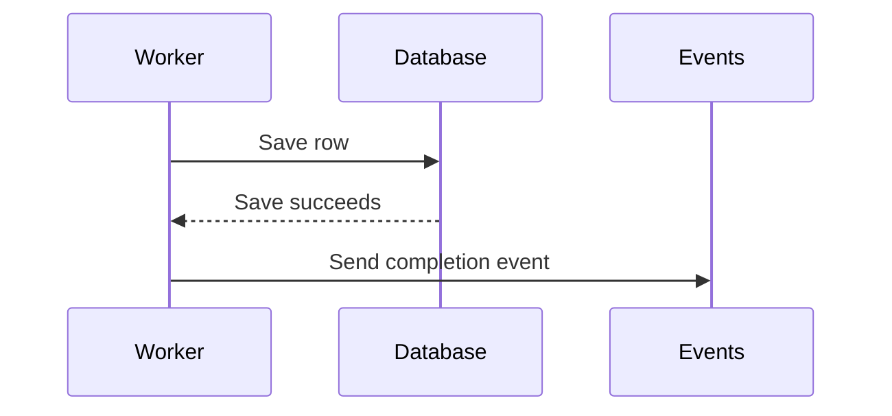

# Writing Pull Requests

Help reviewers understand the problem, the resulting behavior, and the evidence supporting the change. Describe the final patch for someone who has not seen the authoring conversation. Prefer diagrams or images when they explain the change more clearly than prose. Use short captions and keep text for facts the visual cannot show.

Before drafting, inspect the current diff against the intended base, the repository's PR template, and available test results. Use supplied artifacts when repository access is unavailable, and state material evidence gaps. Reconcile the title and body with the final scope after revisions.

## Reader and language

Read and apply $writing-for-human before drafting. The reader is a reviewer who needs to understand the change and verify its evidence. Adapt its reader guidance to that task: problem, resulting behavior, key changes, and validation. Use the repository's PR template instead of its README route.

Write the title, body, and visual labels in [ASD-STE100 Simplified Technical English, Issue 9](https://www.asd-ste100.org/assets/files/ASD-STE100_ISSUE9.pdf). Apply its dictionary and writing rules in addition to the reader guidance:

- Use approved words with their approved meanings, parts of speech, and forms. Verify uncertain words in the STE dictionary.
- Use established software terms as technical nouns or technical verbs only when the standard permits them. Use one term for each concept.
- Use a maximum of 25 words per descriptive sentence and 20 words per instruction. Give each instruction one action.
- Prefer active voice and simple verb forms. Put conditions before instructions. Keep each paragraph about one topic.
- Preserve facts, conditions, risks, and uncertainty when you simplify sentences.

Keep code, commands, paths, identifiers, quoted output, and required template text exact. Use STE for the surrounding explanation. Do not claim verified STE compliance without a review against the standard and dictionary. If these sources are unavailable, state the verification limit outside the PR draft.

## PR Title

Use Conventional Commits format:

```
<type>(<scope>): <description>
```

### Types

| Type       | Use for                                    |
|------------|--------------------------------------------|
| `feat`     | New feature                                |
| `fix`      | Bug fix                                    |
| `docs`     | Documentation only                         |
| `refactor` | Code restructure (no behavior change)      |
| `perf`     | Performance improvement                    |
| `test`     | Adding or fixing tests                     |
| `chore`    | Maintenance, dependencies, configs         |
| `build`    | Build system changes                       |
| `ci`       | CI/CD configuration                        |

### Scope

Optional noun in parentheses describing the affected area: `fix(auth):`, `feat(api):`, `docs(readme):`

### Description Rules

- Use imperative mood: "Add" not "Added" or "Adds"
- Start with capital letter
- No period at end
- Keep under 50 characters when possible

### Examples

```
feat(auth): Add OAuth2 login support
fix(api): Handle null response in user endpoint
docs: Update installation instructions
refactor(db): Simplify query builder logic
feat!: Remove deprecated v1 API endpoints
```

Use `!` before `:` to indicate breaking changes.

## PR Body Template

Follow the repository's template when present. Otherwise, adapt this template to the change. A small fix may need only a summary and validation. Use diagrams, images, or other review aids within Changes to explain behavior and help reviewers navigate the diff. Omit unused sections and checklists.

```markdown
## Summary

<What this PR does and why. Link related issues.>

Fixes #123

## Changes

<A diagram, image, or diff sketch with a short caption, when useful>

- <Specific change 1>
- <Specific change 2>

## Testing

<Commands actually run, observed results, and relevant limits>

<Separate any suggested manual verification from completed checks>

## Checklist

- [ ] Tests added/updated
- [ ] Documentation updated (if needed)
- [ ] Breaking changes noted (if any)
```

## Writing Guidelines

### Summary Section

Lead with the concrete problem and resulting behavior. Include a trigger and before/after example when that makes the change easier to assess.

- Be specific—avoid vague phrases like "improve performance" or "enhance UX"
- Link related issues using keywords: `Fixes #123`, `Closes #456`, `Related to #789`
- Don't assume readers will read linked issues—include essential context

### Changes Section

Show concrete behavior and design choices that help reviewers assess the patch. Prefer a diagram or image to a long explanation of flows, relationships, states, or UI changes. For a change spanning several files, name the entry point and key files or symbols in a useful reading order. Include technical details when they explain a tradeoff, dependency, or risk.

**Good:**
- Add rate limiting to API endpoints
- Update error messages to include request ID

**Avoid:**
- Changed line 42 in auth.js
- Refactored some code

### Review aids

Prefer diagrams or images to long prose when they make the change easier to understand. Select the view by the reviewer's question, not by the rendering tool. Use the smallest useful view and a short caption. A simple change can need only a sentence. Use several views only when each explains a different part of the change.

| Reviewer question | View |
| --- | --- |
| What changed in an existing flow or structure? | A small `diff` sketch |
| What decisions does the new logic make? | Pseudocode |
| Which functions run, and in what order? | A call tree |
| Which UI components own state or cross module boundaries? | A component tree |
| Which files have new responsibilities? | A shallow file tree |
| How do components, data, or states interact? | A sequence, flow, or state diagram, inline or as an attached image |
| What changed in a UI or layout? | Annotated screenshots or a before/after image |
| How does a visible behavior change over time? | A short GIF or video |
| What needs a larger view or an editable source? | A PDF, diagram source, or HTML attachment with an inline preview |

Put each view beside the explanation it supports. Keep only the calls, files, properties, states, and boundaries needed for that explanation. Use names from the patch. Preserve the order of operations, ownership, side effects, and error paths that affect behavior. Write explanations and labels in STE; preserve code names.

Let the visual carry the explanation. Use prose for the problem, captions, decisions, risks, and validation that the visual cannot show. Do not repeat the full visual in a paragraph. Add useful alt text to images. Keep labels readable at the size shown in the PR.

Label simplified views as conceptual. Point to the files or symbols that reviewers can use to verify them. Do not present a conceptual sketch as a literal source diff. Verify all views against the final patch before you finish the PR draft.

#### Show decisions with pseudocode

Show inputs, branches, side effects, and results. Use a `diff` sketch when the surrounding logic already exists:

```diff
 on save(content)
-  persist content
+  if content equals stored content
+    return existing result
+  persist content
+  clear cached content
   return saved result
```

Show the complete block when most of the logic is new or when omitted context would hide ownership or order:

```text
on save(content)
  if content equals stored content
    return existing result
  persist content
  clear cached content
  return saved result
```

Keep pseudocode at the decision level. Include exact source only when reviewers need the implementation details to assess the change.

#### Show calls, components, or files with trees

Use a call tree for a simple sequence of function calls:

```text
submitForm
  createSession
    persistPrompt
    launchAgent
  navigateToSession
```

A tree cannot show every branch or asynchronous interaction. State relevant conditions, or use a sequence diagram when timing matters.

Use a component tree to show UI structure and relevant state ownership:

```text
SessionPage (src/routes/session.tsx; owns session state)
  useSessionEvents()
  SessionToolbar
    RunSkillButton (packages/ui)
  SessionTimeline
```

Use a shallow file tree to show responsibilities in a broad change. Use `diff` when an existing structure changes:

```diff
 src/
 ├── commands/       # parses user actions
 ├── sessions/       # owns session state
-└── transport.ts    # sends requests and receives events
+└── transport/
+    ├── client.ts   # sends requests
+    └── stream.ts   # receives events
```

You can also use `diff` for a component tree or call tree. Include enough context to show where new parts belong.

#### Show interactions with diagrams

Use a sequence diagram for interactions over time, a flow diagram for decisions or data flow, and a state diagram for state changes. Use Mermaid, Graphviz, a diagram editor, or another suitable tool. Render the result as an image when that gives reviewers a clearer view.

For Mermaid, use `sequenceDiagram`, `flowchart`, or `stateDiagram-v2` for these respective views:

For example, this conceptual success path sends a completion event only after the save succeeds:


```mermaid
sequenceDiagram
    participant Worker
    participant Database
    participant Events
    Worker->>Database: Save row
    Database-->>Worker: Save succeeds
    Worker->>Events: Send completion event
```

If failure behavior affects the change, explain or diagram that path too. Do not add a diagram that repeats an adjacent sketch or a short sentence.

#### Show UI changes with images or recordings

Use screenshots, annotated images, or before/after comparisons to show UI and layout changes. Use a short GIF or video for behavior that depends on motion or interaction. Show the relevant state and result, and keep the capture focused on the change.

For a designed illustration or HTML preview, use the product's colors, type, spacing, components, labels, and data. Make an HTML preview readable on desktop and mobile. Open a local preview for the author when useful. State what an illustration represents; do not present it as a captured product result.

#### Attach files on GitHub

Use [GitHub's attachment documentation](https://docs.github.com/en/get-started/writing-on-github/working-with-advanced-formatting/attaching-files) to verify supported types, size limits, and upload contexts. Select a format that reviewers can view easily:

| Purpose | Supported formats | Upload context |
| --- | --- | --- |
| Diagrams and screenshots | `.png`, `.jpg`, `.jpeg`, `.svg` | All contexts |
| Motion or interaction | `.gif`, `.mp4`, `.mov`, `.webm` | All contexts |
| Larger documents or editable diagrams | `.pdf`, `.drawio` | PR comments |
| Downloadable previews or supporting files | `.html`, `.htm`, `.txt`, `.md`, `.patch`, `.zip` | PR comments |

The documentation lists other supported formats. Support for an attachment does not mean that GitHub renders it inline. For downloadable sources or HTML, include an image preview of the key point in the PR body.

Images and GIFs have a 10 MB limit. Videos have a 10 MB limit on free plans and a 100 MB limit on paid plans, subject to GitHub's upload conditions. Other files have a 25 MB limit. Prefer H.264 for video compatibility.

Upload through GitHub's attachment control, or use GitHub CLI for supported local images and videos. Use the returned attachment URL in the PR. Files uploaded to public repositories are accessible without authentication; private and internal repository attachments require repository access.

If the task is to draft content only, provide the local files and mark their intended positions in the draft. Do not invent uploaded URLs. A local path is not an attachment. Keep the core explanation visible in the PR body; use attachments for larger views, recordings, or editable sources.

### Testing Section

Report validation that actually happened. Name the command, tested behavior, and observed result; include the revision or environment when it affects reproducibility. Link relevant test cases, CI runs, or captured output when available. Keep excerpts short and preserve the assertion or failure reason that matters.

Separate completed checks from suggested verification. State relevant checks not run and material limits, such as mocked dependencies or untested concurrency. If no results are available, say so instead of turning proposed commands into passing evidence.

#### TDD evidence

When test-driven development was used and its sequence is supported by execution records, include a compact account in Testing:

| Stage | Evidence to include |
|-------|---------------------|
| Red | The test and command run before implementation, plus the observed failure showing the missing behavior. An unrelated setup failure does not establish this. |
| Green | The same test passing after the implementation, with the command and observed result. |
| Refactor, if performed | What was simplified and which checks passed afterward. |

Include broader regression checks separately, with their actual scope and results. Passing tests alone do not establish TDD. If tests were added after implementation, describe them as regression coverage. Replaying a test against the old code afterward can demonstrate the regression, but does not prove the test was written first. If a TDD claim is requested but the sequence is unknown, state that it is unverified and report the evidence available. Do not invent earlier failures, refactoring steps, logs, or test counts.

### Breaking Changes

If the PR introduces breaking changes, add a section:

```markdown
## Breaking Changes

- `oldMethod()` removed—use `newMethod()` instead
- Config option `foo` renamed to `bar`
```

## Checklist Usage

- Mark items with `[x]` only when actually completed
- Remove items that don't apply, or mark as N/A
- Common items: tests, docs, migrations, changelog

## Quick Reference

| Do | Don't |
|----|-------|
| Use imperative mood | Use past tense |
| Link issues explicitly | Assume context |
| List specific changes | Be vague |
| Provide test steps | Say "tested locally" |
| Note breaking changes | Hide API changes |
