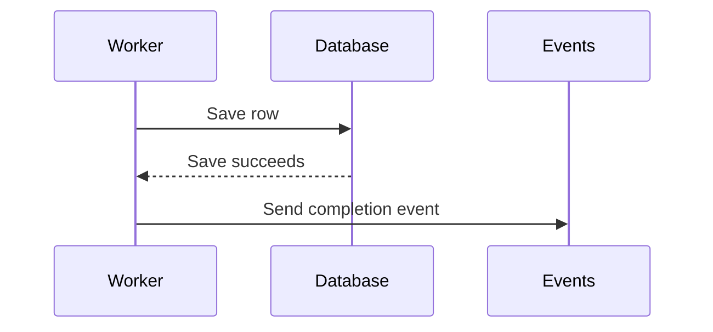

# Review aids

Prefer diagrams or images to long prose when they make the change easier to understand. Select the view by the reviewer's question, not by the rendering tool. Use the smallest useful view and a short caption. A simple change can need only a sentence. Use several views only when each explains a different part of the change.

| Reviewer question | View |
| --- | --- |
| What changed in an existing flow or structure? | A small `diff` sketch |
| What decisions does the new logic make? | Pseudocode |
| Which functions run, and in what order? | A call tree |
| Which UI components own state or cross module boundaries? | A component tree |
| Which files have new responsibilities? | A shallow file tree |
| How do components, data, or states interact? | A sequence, flow, or state diagram, inline or as an attached image |
| What changed in a UI or layout? | Annotated screenshots or a before/after image |
| How does a visible behavior change over time? | A short GIF or video |
| What needs a larger view or an editable source? | A PDF, diagram source, or HTML attachment with an inline preview |

Put each view beside the explanation it supports. Keep only the calls, files, properties, states, and boundaries needed for that explanation. Use names from the patch. Preserve the order of operations, ownership, side effects, and error paths that affect behavior. Write explanations and labels in STE; preserve code names.

Let the visual carry the explanation. Use prose for the problem, captions, decisions, risks, and validation that the visual cannot show. Do not repeat the full visual in a paragraph. Add useful alt text to images. Keep labels readable at the size shown in the PR.

Label simplified views as conceptual. Point to the files or symbols that reviewers can use to verify them. Do not present a conceptual sketch as a literal source diff. Verify all views against the final patch before you finish the PR draft.

## Show decisions with pseudocode

Show inputs, branches, side effects, and results. Use a `diff` sketch when the surrounding logic already exists:

```diff
 on save(content)
-  persist content
+  if content equals stored content
+    return existing result
+  persist content
+  clear cached content
   return saved result
```

Show the complete block when most of the logic is new or when omitted context would hide ownership or order:

```text
on save(content)
  if content equals stored content
    return existing result
  persist content
  clear cached content
  return saved result
```

Keep pseudocode at the decision level. Include exact source only when reviewers need the implementation details to assess the change.

## Show calls, components, or files with trees

Use a call tree for a simple sequence of function calls:

```text
submitForm
  createSession
    persistPrompt
    launchAgent
  navigateToSession
```

A tree cannot show every branch or asynchronous interaction. State relevant conditions, or use a sequence diagram when timing matters.

Use a component tree to show UI structure and relevant state ownership:

```text
SessionPage (src/routes/session.tsx; owns session state)
  useSessionEvents()
  SessionToolbar
    RunSkillButton (packages/ui)
  SessionTimeline
```

Use a shallow file tree to show responsibilities in a broad change. Use `diff` when an existing structure changes:

```diff
 src/
 ├── commands/       # parses user actions
 ├── sessions/       # owns session state
-└── transport.ts    # sends requests and receives events
+└── transport/
+    ├── client.ts   # sends requests
+    └── stream.ts   # receives events
```

You can also use `diff` for a component tree or call tree. Include enough context to show where new parts belong.

## Show interactions with diagrams

Use a sequence diagram for interactions over time, a flow diagram for decisions or data flow, and a state diagram for state changes. Use Mermaid, Graphviz, a diagram editor, or another suitable tool. Render the result as an image when that gives reviewers a clearer view.

For Mermaid, use `sequenceDiagram`, `flowchart`, or `stateDiagram-v2` for these respective views:

For example, this conceptual success path sends a completion event only after the save succeeds:



If failure behavior affects the change, explain or diagram that path too. Do not add a diagram that repeats an adjacent sketch or a short sentence.

## Show UI changes with images or recordings

Use screenshots, annotated images, or before/after comparisons to show UI and layout changes. Use a short GIF or video for behavior that depends on motion or interaction. Show the relevant state and result, and keep the capture focused on the change.

For a designed illustration or HTML preview, use the product's colors, type, spacing, components, labels, and data. Make an HTML preview readable on desktop and mobile. Open a local preview for the author when useful. State what an illustration represents; do not present it as a captured product result.

## Attach files on GitHub

Use [GitHub's attachment documentation](https://docs.github.com/en/get-started/writing-on-github/working-with-advanced-formatting/attaching-files) to verify supported types, size limits, and upload contexts. Select a format that reviewers can view easily:

| Purpose | Supported formats | Upload context |
| --- | --- | --- |
| Diagrams and screenshots | `.png`, `.jpg`, `.jpeg`, `.svg` | All contexts |
| Motion or interaction | `.gif`, `.mp4`, `.mov`, `.webm` | All contexts |
| Larger documents or editable diagrams | `.pdf`, `.drawio` | PR comments |
| Downloadable previews or supporting files | `.html`, `.htm`, `.txt`, `.md`, `.patch`, `.zip` | PR comments |

The documentation lists other supported formats. Support for an attachment does not mean that GitHub renders it inline. For downloadable sources or HTML, include an image preview of the key point in the PR body.

Images and GIFs have a 10 MB limit. Videos have a 10 MB limit on free plans and a 100 MB limit on paid plans, subject to GitHub's upload conditions. Other files have a 25 MB limit. Prefer H.264 for video compatibility.

Upload through GitHub's attachment control, or use GitHub CLI for supported local images and videos. Use the returned attachment URL in the PR. Files uploaded to public repositories are accessible without authentication; private and internal repository attachments require repository access.

If the task is to draft content only, provide the local files and mark their intended positions in the draft. Do not invent uploaded URLs. A local path is not an attachment. Keep the core explanation visible in the PR body; use attachments for larger views, recordings, or editable sources.
