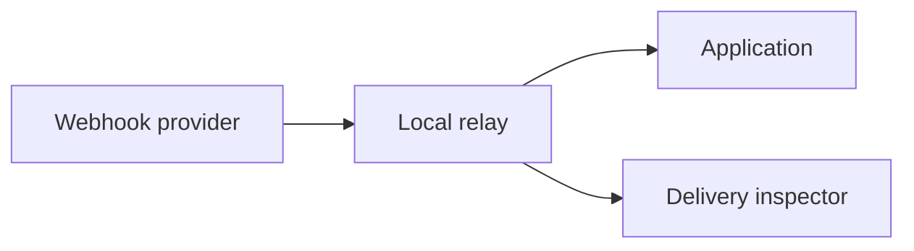

# Writing for human readers

A README is a route, not a warehouse. Help a specific reader reach a useful result without studying the whole project first.

Judge it by four outcomes: the reader gets what they need, finds it, understands it on the first reading, and uses it.

## Start with evidence

For a new README or substantial rewrite, name the primary reader and their first useful result, then inspect the repository for the facts below. For a local edit, verify only affected claims and directly related context; do not inventory the whole project:

- Installation commands, supported versions, and package names
- Working examples, options, defaults, ports, paths, and environment variables
- Limits, security properties, compatibility, warnings, and support status

Run `--help` or focused tests when useful. Treat examples as examples unless the project defines them as defaults. Mark unresolved facts instead of filling gaps with plausible conventions.

## Build the reader's route

Use this reading path as a default. Omit rows that add no value.

| Reader's question | README content |
| --- | --- |
| What is this, and is it for me? | One sentence naming the project, audience, and result |
| Can I use it safely? | Requirements, limits, and early warnings |
| How do I start? | The shortest verified path to first success |
| How does it work? | Only the mental model needed to use or debug it |
| How do I adjust or recover? | Common tasks, configuration, and symptom-led troubleshooting |
| Where is deeper detail? | Links to reference, contribution, or license material when needed |

Keep the first success near the top. Put each command beside its purpose, prerequisites, and expected result. Link to specialized detail instead of making every reader carry it.

## Write plain technical English

- Give each sentence one idea, each paragraph one topic, and each numbered step one instruction.
- Prefer active voice, explicit actors, direct verbs, and imperative instructions.
- Put a necessary condition before its instruction.
- Use familiar words. Preserve canonical names and capitalization. Define necessary technical terms once and use one term per concept.
- Write headings that name a task, decision, or result.
- Use lists for parallel items, tables for lookup, and prose for reasoning.
- Treat 25 words as a reason to inspect a sentence, not as a hard limit.
- Preserve facts, numbers, conditions, risks, and honest uncertainty.

Remove throat-clearing, marketing filler, repeated facts, and empty boilerplate. These rules borrow from ASD-STE100, but do not enforce its dictionary or claim strict compliance.

## Show a flow when prose makes the reader backtrack

Prefer Mermaid for a workflow, lifecycle, state transition, decision, or relationship among at least three meaningful parts. Keep text or a table when it is clearer.

Choose the diagram that matches the question:

- `flowchart LR` or `flowchart TD`: movement and decisions
- `sequenceDiagram`: interactions over time
- `stateDiagram-v2`: states and transitions

Use reader-facing labels and the same terms as the prose. Put the diagram after the introduction, before detailed reference, and add one sentence that tells the reader what to notice.

## Finish with a human check

For a local edit, check the changed passage and affected claims. For a new README or substantial rewrite, read as a first-time user and confirm:

- The first screen explains the project and gives a next step.
- The quick start is complete, ordered, copyable, and supported by evidence.
- Every default, guarantee, command, link, and diagram is accurate.
- Warnings appear before the action that creates the risk.
- Headings let a returning reader find one fact without rereading.
- The document says enough to succeed, then stops.

Return the finished document. Mention missing evidence separately only when it prevents an accurate README.

## Sources and scope

This unofficial synthesis draws on:

- [ISO 24495-1 plain-language reader outcomes](https://www.iplfederation.org/iso-standard/)
- [ASD-STE100 Simplified Technical English, Issue 9](https://www.asd-ste100.org/assets/files/ASD-STE100_ISSUE9.pdf)

Use this skill for people. Agent instructions need a different optimization target.
